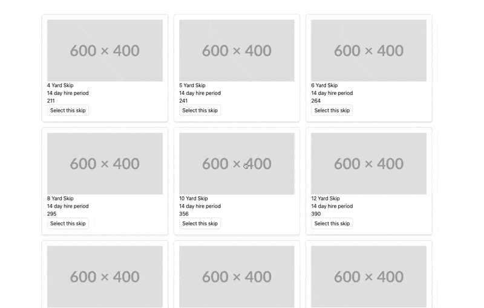
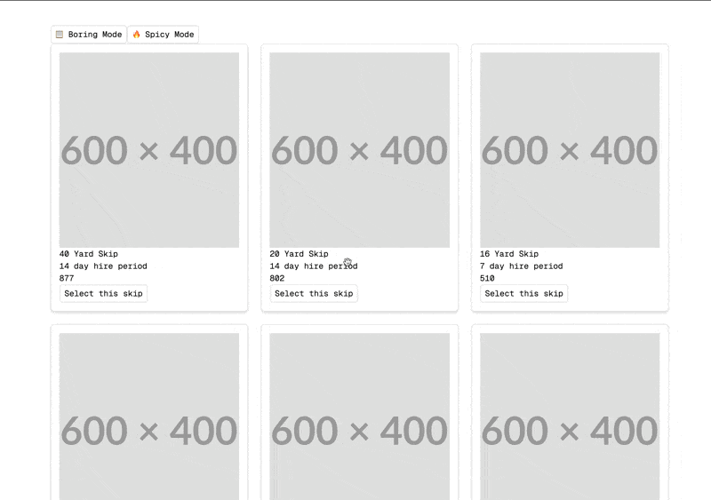
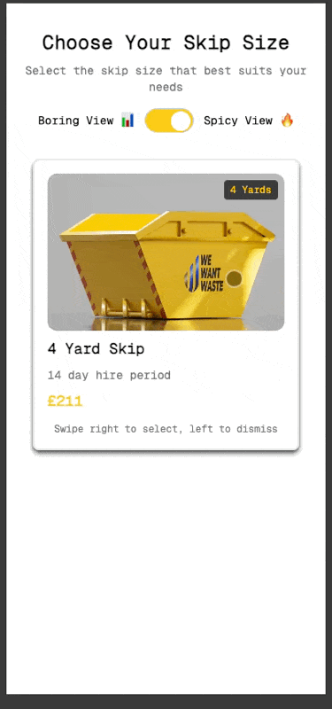

# Skip Size Selection Redesign

## Project Overview
This project is a redesigned version of the "choose your skip size" page from WeWantWaste.co.uk. The goal was to create a completely different look while maintaining the original functionality.

## Tech Stack
- **Frontend Framework**: React
- **State Management**: React Context API
- **Styling**: Tailwind CSS
- **Animation**: Motion One

## Features
- Completely redesigned UI for the skip selection page
- Responsive design for both mobile and desktop browsers
- Data fetched from the API endpoint: https://app.wewantwaste.co.uk/api/skips/by-location?postcode=NR32&area=Lowestoft
- Clean, maintainable React code
- Current selection is saved to local storage and restored on page load
- View mode can be toggled between grid and tinder
- Tinder mode allows you to swipe left or right to select or dismiss a skip
- Grid mode allows you to select a skip by clicking on it
- Skips are sorted by size in descending order

## Approach

- v0.1.0: Initial version with basic functionality

  
- v0.2.0: Added Tinder-style view mode

  

- v0.3.0: UI/UX improvements

  

## Known Bugs

- Tinder mode doesnt loop over the skips it just removes them from the array
